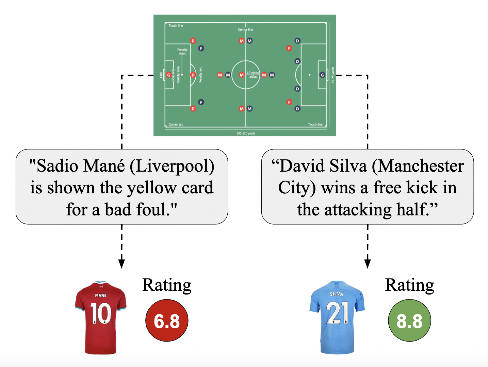
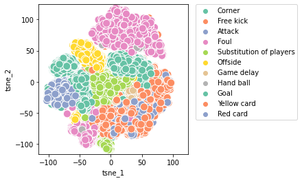
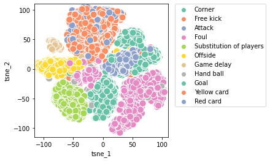
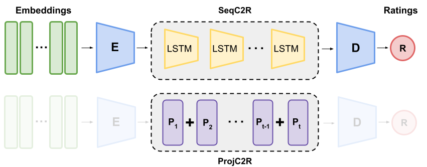

# commentary2ratings
Using football commentaries to predict player ratings in a football match.

<div style="text-align: center"></div>

## Requirements

- python 3.8

## Installation Instructions

1. Go into project folder
2. Create and activate virtualenv with python 3.8: https://docs.python.org/3/library/venv.html
3. Clone this repository
4. Install requirements and package,
```
cd commentary2ratings
pip3 install -r requirements.txt
pip3 install -e .
```
5. Create data and experiment directory in the project repository,
```
mkdir ./data_files
export DATA_DIR=./data_files
mkdir ./experiments
export EXP_DIR=./experiments
```

## Download Data
We've made the data available on [Kaggle](https://www.kaggle.com/datasets/emmahawk/football-player-rating-stats-event-commentary).

Following we provide the t-sne of the commentaries embeddings obtained from BERT and XLNet respectively.




<!-- ## Download Data

Download data from [here](https://drive.google.com/drive/folders/1W76B70aN-adoJcYoX7mwDY1A8YQSNvHL?usp=sharing). Add it to the data_files folder created in step 5 above

data description
- fixtures.csv : contains information about the fixtures. Important fields are date and team ids to uniquely identify a match
- data_football_ratings.csv : contains player ratings. Using data and team names, identify the corresponding players from the game and fetch their ratings
- commentary : folder containing 380 commentary files named by their unique fixture_id
- player_comments_ratings.csv: contains players and their associated commentaries per fixture
- processed_data_bert.h5 : data file which is loaded by the dataloader. Contains 'player'(one hot vector), 'rating', 'padded_commentary_embedding.h5'(bert embedded commentary data of size NxLx768 where N is the number of data points and L largest number of commentaries for a player in a match), 'commentary_len'(true number of commentaries for that corresponding index <=L)
- processed_data_xlnet.h5 : same as above except embeddings from xlnet -->


## Model Architecture

Below is the model architectures we try to predict player ratings from a list of commentaries. All implementations can be found in the [models](https://github.com/ShivinDass/commentary2ratings/tree/main/commentary2ratings/models) folder.

 