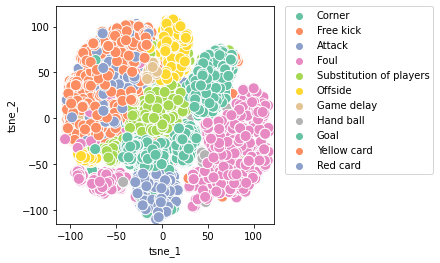
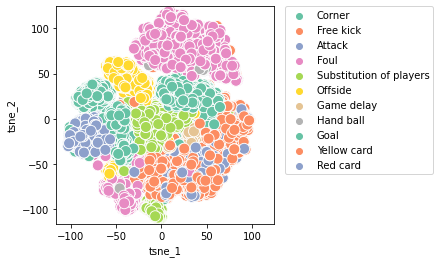
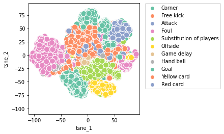
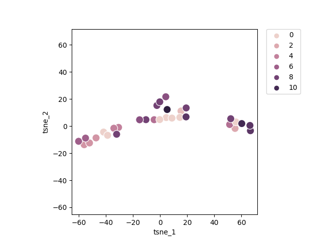

# LM Embeddings
Using footbal commentaries to obtain their vector representations.

## Requirements

- transformers 4.23.1
- Can be installed by ```pip3 install transformers```

## Files

1. ```bert.py```: Contains a commentary embedding system using a BERT pretrained model.
2. ```xlnet.py```: Contains a commentary embedding system using a XLNet pretrained model.
3. ```train_data.py```: Contains a list of 31 text samples. They are the same as in NER package.
4. ```visualiztion.py```: Contains a helper function to show the t-SNE plots.


## Usage

To test the correct functioning of ```bert.py``` execute: ```python3 bert.py```. This will take the samples in the default data directory (assuming the instructions in the main README have been followed) ```../../data_files/player_comments_ratings.csv``` compute the embedding for each commentary. Then it generates the t-SNE plot by taking manually given labels following the schema below.

- 0: Substitution of players
- 1: Yellow card
- 2: Second half comment
- 3: Attack
- 4: Offside
- 5: Corner
- 6: Goal
- 7: Blocked attack
- 8: Free kick
- 9: Foul
- 10: Hand ball
- 11: Game delay
- 12: Red card

## BERT t-SNE plot




## XLNet t-SNE plot



